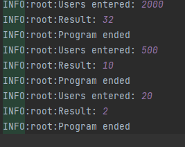

# labsPP
___
Разработал Гвоздев А.М. Фт-210008
---
---
В некоторой стране используются денежные купюры достоинством в 1, 2, 4, 8, 16, 32 и 64. Дано натуральное число N. Как наименьшим количеством таких денежных купюр можно выплатить сумму n (указать количество каждой из используемых для выплаты купюр)? Предполагается, что имеется достаточно большое количество купюр всех достоинств. 
---
---
Открывать файл lab10.py в любой IDE поддерживающей Python
---
---
Примеры работы программы
